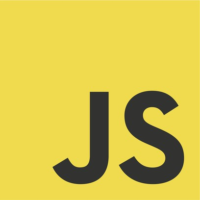

#### Code :D 

### ***English***
Hi! My name is Code, I'm from Colombia, but I speak English almost all the time so it doesn't matter if you speak English or Spanish, I will understand you.
> I am a beginner developer, developer of various Discord bots like [OmegaNinja](https://discord.com/api/oauth2/authorize?client_id=725772192159105752&permissions=8&scope=bot), [OrixUSH](https://fxz-org.com/orix-mejor-bot-discord/) (Bot from [FxZ Organization](https://fxz-org.com/))

### Knowledge:

### Contact:
 : [`Code<3#7849`] Discord - PFP: 
<!--------------- Teams ----------------->
#### Teams:
[`FxZ-Org`](https://github.com/OrganizacionFxZ)
[`SS-Assistant`](https://github.com/SS-Assistant)
[`Taiki`](https://github.com/Taiki-Bot)
### Bots:
OrixUSH   |Taiki
-----------|-----------
[Support Server](https://discord.gg/dk93wzehF9) - [Invite](https://fxz-org.com/orix-mejor-bot-discord/) | [Support Server](https://discord.gg/taiki) - [Invite](https://discord.com/oauth2/authorize?client_id=860344927849152513&permissions=8&scope=bot)

